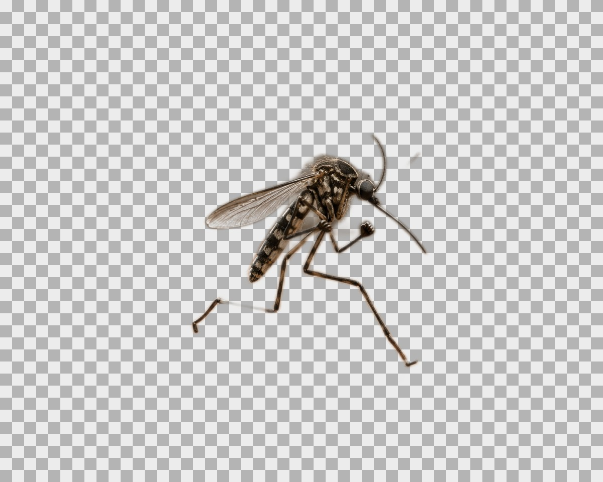
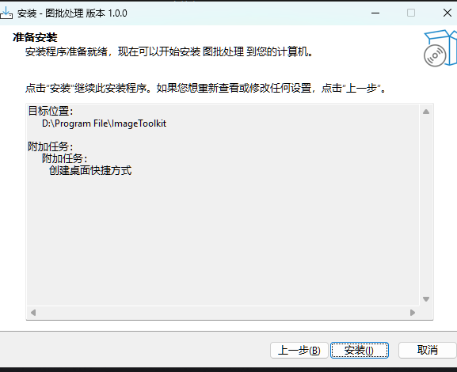
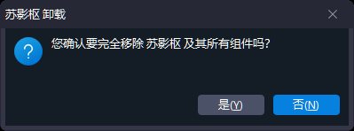

# 苏影枢 Image Toolkit

[](https://github.com/ljy-codes/image-toolkit/releases/latest)
[](#运行环境)
[](#开发与构建)
[](LICENSE)

苏影枢是一款开源的 Windows 本地桌面图片批处理工具。它把图片导入、预览、严格压缩、尺寸调整、格式转换、本地 AI 抠图和安全导出集中在一个工作台中完成。

图片处理全程在本机执行，不上传图片、文件路径、配置或日志。

## AI 抠图实测

| 人像模型 | 商品 / 通用物体模型 |
| --- | --- |
|  |  |

以上图片来自真实 ONNX 推理验收，棋盘格区域表示透明背景。

## 下载

前往 [GitHub Releases](https://github.com/ljy-codes/image-toolkit/releases/latest) 下载最新正式版本。

v1.1.0 Release 提供以下附件：

- Windows 11 x64 自包含安装包：`SuYingShu-Setup-1.1.0.exe`。
- 产品与功能介绍：`SuYingShu-Product-Guide.html`、`SuYingShu-Product-Guide.pdf`。
- 安装与卸载说明：`SuYingShu-Installation-Guide.html`、`SuYingShu-Installation-Guide.pdf`。
- SHA256 校验信息和版本更新说明。

安装包自包含 .NET 运行环境，普通用户无需额外安装 .NET SDK。

## 快速开始

1. 从 Releases 下载最新安装包。
2. 双击安装包，按向导完成安装。
3. 启动“苏影枢”，点击“添加图片”或“添加文件夹”。
4. 在右侧设置目标大小、尺寸、AI 抠图、背景、格式和输出方式。
5. 选择队列中的图片检查处理后预览。
6. 点击“开始处理”，完成后按输出路径取用文件。

> 当前安装包未进行代码签名。Windows SmartScreen 可能显示保护提示，请核对下载来源和 Release 中的 SHA256 后再运行。

## 核心功能

| 能力 | 说明 |
| --- | --- |
| 批量导入 | 支持添加图片、文件夹、拖放导入和子文件夹扫描。 |
| 严格目标压缩 | 输出必须小于或等于目标大小；无法达标时不保留超标文件，并直接显示原因和建议。 |
| PNG 优化 | 优先执行无损压缩，可选择颜色量化，并在允许范围内自动缩小尺寸。 |
| 尺寸与比例 | 默认保留原尺寸；启用后可指定宽高、锁定比例、裁剪或补边。 |
| 本地 AI 抠图 | 提供人像和商品/通用物体两类 ONNX 模型，按需下载，安装后可断网使用。 |
| 背景处理 | 支持白色、黑色、透明和自定义颜色；输出 JPEG 时安全合成背景。 |
| 格式转换 | 可保持原格式，或输出 JPEG、PNG、WebP、BMP。 |
| 元数据管理 | 可保留普通 EXIF 与 ICC 色彩配置；GPS 信息默认删除。 |
| 实时预览 | 显示原图和处理后效果，参数变化时自动取消过期预览。 |
| 命名参数方案 | 常用参数可命名保存、应用、更新、重命名和删除，并持久化到本机。 |
| 配置导入导出 | 使用 `.syconfig` 文件迁移当前处理参数、外观设置和全部命名方案。 |
| 批任务控制 | 支持暂停、继续、安全取消、失败项重试、清空和开启下一批。 |
| 输出详情 | 展示输出大小、最终尺寸、路径、失败环节、具体原因和处理建议。 |
| 外观设置 | 支持浅色、深色、跟随系统主题、字体大小和工作区背景设置。 |

## 格式支持

| 格式 | 输入 | 输出 | 备注 |
| --- | :---: | :---: | --- |
| JPEG / JPG | 是 | 是 | 支持目标大小压缩、背景合成和质量搜索。 |
| PNG | 是 | 是 | 支持透明通道、无损压缩和可选有损量化。 |
| WebP | 是 | 是 | 支持质量搜索和格式转换。 |
| BMP | 是 | 是 | 适合无损中间文件或兼容性输出。 |
| TIFF | 是 | 有限 | 单页 TIFF 可保持原格式；多页 TIFF 不允许覆盖原文件。 |
| HEIC / AVIF | 否 | 否 | 当前版本暂不支持。 |

## 工作流程

### 1. 导入

通过文件选择器、文件夹扫描或拖放添加图片。队列会显示文件名、尺寸、大小、状态和处理结果。

### 2. 设置与预览

可组合设置压缩、目标大小、尺寸、比例、裁剪锚点、AI 抠图、背景、元数据和输出位置。选择队列图片后会自动生成处理预览。

尺寸调整默认关闭，未启用时宽度和高度不需要填写。常用组合可保存为命名方案，下次直接应用。

参数方案区域支持导入和导出完整配置：

- 导出内容包括当前处理参数、主题与工作区外观、子文件夹选项和全部命名方案。
- 不导出 AI 模型、日志、图片、处理历史或其他本机文件。
- 导入前会显示导出时间和方案数量，确认后才覆盖当前配置。
- 配置包中的指定输出目录在本机不存在时，会恢复为“原目录新文件”，并明确显示修正数量和原因。
- 导入保存中断时会尝试恢复导入前的配置和命名方案。

### 3. 批量处理

任务运行期间可以暂停、继续或安全取消。失败项可单独重试，程序关闭时会等待后台任务退出。完成后可直接清空或开启下一批，上一轮队列、结果、预览和进度不会干扰新任务。

### 4. 获取结果

支持三种输出模式。默认规则如下：

- 单文件输入：在原文件目录生成 `原名-已处理.扩展名`。
- 文件夹输入：在原文件夹同级生成 `原文件夹-已处理`，并保留子目录结构。
- 文件夹中的失败项：原图复制到同级 `原文件夹-未处理`，同时生成 UTF-8 的 `失败原因.txt` 和 `失败原因.csv`。
- 输出到指定目录。
- 经二次确认后覆盖原文件。

严格压缩无法达到目标时，结果标记为“未达标”，不保留超标输出，原图保持不变。

## AI 模型

AI 抠图默认关闭，不影响普通图片处理。首次使用时可在“AI 抠图”区域按需安装：

| 模型 | 适用场景 | 本地文件 |
| --- | --- | --- |
| 人像抠图模型 | 人物、头像、半身照和全身照 | `u2net_human_seg.onnx` |
| 商品 / 通用物体模型 | 商品、器物和普通独立主体 | `u2net.onnx` |

- 模型下载后保存在 `%LOCALAPPDATA%\ImageToolkit\models`。
- 下载完成后校验文件大小和 SHA256，校验失败不会安装。
- 安装包和 Release 附件不包含 AI 模型；模型来源与授权复核见 `docs/licenses/AI-MODELS.md`。
- 推理全程在本机执行，图片不会上传。
- 模型未安装或推理失败时，队列直接显示失败环节、具体原因和处理建议。
- 模型文件可在应用中删除，不需要卸载主程序。

## 隐私与安全

### 本地隐私

- 图片读取、解码、处理和编码均在当前电脑完成。
- AI 模型下载需要网络；模型安装后，图片抠图在本机离线执行。
- 不上传图片、文件路径、配置或日志。
- GPS 信息默认删除，仅在用户主动开启后保留。
- 日志保存在 `%LOCALAPPDATA%\ImageToolkit\Logs`，最多保留 14 个按日文件。

### 输出安全

- 新文件输出时自动处理重名，避免意外覆盖。
- 覆盖模式必须保持原格式并再次确认。
- 覆盖原图时先写入同目录临时文件，校验可读性后再进行原子替换。
- 取消任务不会保留未完成的空占位文件。
- 多页 TIFF 不允许覆盖原文件，避免页面丢失。

## 安装与卸载



### 安装

运行 Release 中的安装包并按向导继续。默认仅为当前 Windows 用户安装，可选择是否创建桌面快捷方式。

### 卸载

可使用以下任一方式：

- Windows“设置” -> “应用” -> “已安装的应用” -> 搜索“苏影枢” -> “卸载”。
- Windows 开始菜单 -> “苏影枢” -> 运行卸载入口。

卸载不会删除用户生成或导出的图片。配置和日志可能继续保留在 `%LOCALAPPDATA%\ImageToolkit`，确认不再需要后可手动删除。



## 运行环境

- 已验证：Windows 11 x64。
- ARM64：实验性支持，尚未完成正式验证。
- 安装包：自包含运行环境，无需单独安装 .NET。
- 开发环境：.NET 10 SDK、PowerShell、Inno Setup 6.7.3 或更高版本。

## 已知限制

- HEIC、AVIF 暂不支持。
- AI 模型体积较大，需要用户首次按需下载。
- CPU 推理速度取决于图片数量、分辨率和电脑性能。
- 多页 TIFF 可以作为输入生成新文件，但不会覆盖原文件。
- 安装包尚未代码签名，SmartScreen 可能显示提示。

## 项目结构

```text
src/
  ImageToolkit.App/               WPF 桌面应用和视图模型
  ImageToolkit.Application/       用例、验证和批任务协调
  ImageToolkit.Domain/            领域模型、枚举和接口
  ImageToolkit.Infrastructure/    图片处理、文件、配置和日志
  ImageToolkit.Infrastructure.AI/ AI 扩展边界
tests/
  ImageToolkit.App.Tests/
  ImageToolkit.Application.Tests/
  ImageToolkit.Domain.Tests/
  ImageToolkit.Infrastructure.Tests/
installer/                         Inno Setup 安装脚本
scripts/                           构建、测试、发布和打包脚本
```

## 开发与构建

要求安装 .NET 10 SDK。仓库使用中央包版本管理。

```powershell
dotnet restore ImageToolkit.sln
dotnet build ImageToolkit.sln -c Release -m:1 -p:UseSharedCompilation=false
dotnet test ImageToolkit.sln -c Release -m:1 -p:UseSharedCompilation=false
dotnet run --project src/ImageToolkit.App
```

也可以使用仓库脚本：

```powershell
powershell -ExecutionPolicy Bypass -File scripts/build.ps1
powershell -ExecutionPolicy Bypass -File scripts/test.ps1
powershell -ExecutionPolicy Bypass -File scripts/test.ps1 -IncludeUserAssets
powershell -ExecutionPolicy Bypass -File scripts/publish.ps1
powershell -ExecutionPolicy Bypass -File scripts/package.ps1 -Version 1.1.0
```

发布输出：

- 自包含程序：`artifacts/publish/win-x64`
- 安装包：`artifacts/installer/ImageToolkitSetup.exe`

## 测试

当前开发版本自动化测试覆盖：

- 严格目标压缩和超标文件清理。
- 单文件、文件夹、嵌套目录和失败归档路径。
- 批次取消、下一批重置和过期进度隔离。
- 参数默认值、命名方案持久化、完整配置包往返、损坏配置拒绝和导入回滚。
- AI 模型下载、大小校验、SHA256 校验、删除和真实 ONNX 推理冒烟。
- WPF ViewModel、预览取消和 AI 预览调用。

v1.1.0 已完成从 v1.0.0 覆盖升级、全新启动、卸载和安装目录残留检查。

## 版本记录

参见 [CHANGELOG.md](CHANGELOG.md)。

## 许可证

本项目使用 [MIT License](LICENSE)。
